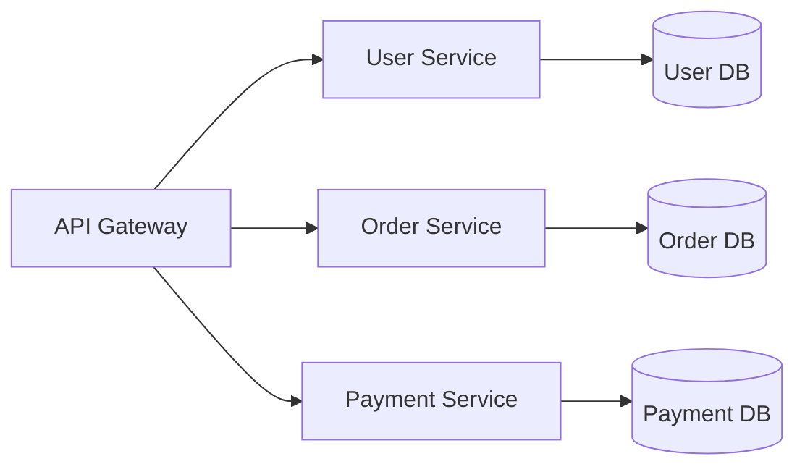

# Building Scalable Systems: A Comprehensive Guide

Building scalable systems is one of the most challenging aspects of modern software development. In this comprehensive guide, we'll explore the key principles, patterns, and practices that help in creating systems that can handle growth efficiently.

## Understanding Scalability

Scalability is the capability of a system to handle increased load without compromising performance. There are two main types of scalability:

1. **Vertical Scaling (Scale Up)**
   - Adding more power to existing resources
   - Examples: Upgrading CPU, RAM, or disk space
   - Limitations: Hardware constraints, cost

2. **Horizontal Scaling (Scale Out)**
   - Adding more resources to distribute the load
   - Examples: Adding more servers to a cluster
   - Benefits: Better fault tolerance, cost-effective

## Key Principles of Scalable Systems

### 1. Loose Coupling

```python
# Bad Example - Tight Coupling
class OrderProcessor:
    def process(self, order):
        payment = PaymentProcessor()
        notification = NotificationService()
        inventory = InventorySystem()
        
        payment.process(order)
        inventory.update(order)
        notification.send(order)

# Good Example - Loose Coupling
class OrderProcessor:
    def __init__(self, payment_service, notification_service, inventory_service):
        self.payment_service = payment_service
        self.notification_service = notification_service
        self.inventory_service = inventory_service
    
    def process(self, order):
        self.payment_service.process(order)
        self.inventory_service.update(order)
        self.notification_service.send(order)
```

### 2. Stateless Design

Keeping your services stateless makes them easier to scale horizontally. Store state in distributed caches or databases instead of in-memory.

### 3. Caching Strategy

Implement multiple layers of caching:

```python
from functools import lru_cache
import redis

# Memory Cache
@lru_cache(maxsize=1000)
def get_user_preferences(user_id):
    return db.query(f"SELECT preferences FROM users WHERE id = {user_id}")

# Distributed Cache
redis_client = redis.Redis(host='localhost', port=6379)

def get_user_data(user_id):
    # Try cache first
    cached_data = redis_client.get(f"user:{user_id}")
    if cached_data:
        return cached_data
    
    # If not in cache, get from database
    data = db.query(f"SELECT * FROM users WHERE id = {user_id}")
    
    # Store in cache for future requests
    redis_client.setex(f"user:{user_id}", 3600, data)  # Expire in 1 hour
    return data
```

## Architectural Patterns

### 1. Microservices Architecture

Breaking down your application into smaller, independently deployable services:



### 2. Event-Driven Architecture

Using message queues for asynchronous processing:

```python
import pika

# Publisher
connection = pika.BlockingConnection(pika.ConnectionParameters('localhost'))
channel = connection.channel()
channel.queue_declare(queue='order_processing')

def publish_order(order):
    channel.basic_publish(
        exchange='',
        routing_key='order_processing',
        body=json.dumps(order)
    )

# Consumer
def process_order(ch, method, properties, body):
    order = json.loads(body)
    # Process the order
    print(f"Processing order: {order}")

channel.basic_consume(
    queue='order_processing',
    on_message_callback=process_order,
    auto_ack=True
)
```

## Performance Optimization

### 1. Database Optimization

```sql
-- Add appropriate indexes
CREATE INDEX idx_user_email ON users(email);
CREATE INDEX idx_order_user_date ON orders(user_id, created_at);

-- Use materialized views for complex queries
CREATE MATERIALIZED VIEW monthly_sales AS
SELECT 
    date_trunc('month', created_at) as month,
    sum(amount) as total_sales
FROM orders
GROUP BY 1;
```

### 2. Load Balancing

Using Nginx as a load balancer:

```nginx
upstream backend {
    least_conn;  # Least connections algorithm
    server backend1.example.com:8080;
    server backend2.example.com:8080;
    server backend3.example.com:8080;
}

server {
    listen 80;
    location / {
        proxy_pass http://backend;
    }
}
```

## Monitoring and Scaling

### 1. Key Metrics to Monitor

- Response Time
- Error Rate
- Resource Utilization
- Throughput

### 2. Auto-scaling Configuration

AWS Auto Scaling example:

```yaml
AWSTemplateFormatVersion: '2010-09-09'
Resources:
  AutoScalingGroup:
    Type: AWS::AutoScaling::AutoScalingGroup
    Properties:
      MinSize: '2'
      MaxSize: '10'
      DesiredCapacity: '2'
      HealthCheckType: ELB
      LaunchTemplate:
        LaunchTemplateId: !Ref LaunchTemplate
        Version: !GetAtt LaunchTemplate.LatestVersionNumber

  ScalingPolicy:
    Type: AWS::AutoScaling::ScalingPolicy
    Properties:
      AutoScalingGroupName: !Ref AutoScalingGroup
      PolicyType: TargetTrackingScaling
      TargetTrackingConfiguration:
        PredefinedMetricSpecification:
          PredefinedMetricType: ASGAverageCPUUtilization
        TargetValue: 70.0
```

## Best Practices Checklist

- [ ] Implement proper caching strategies
- [ ] Use asynchronous processing for long-running tasks
- [ ] Implement circuit breakers for external services
- [ ] Use connection pooling for databases
- [ ] Implement proper monitoring and alerting
- [ ] Use CDN for static content
- [ ] Implement proper error handling and retry mechanisms
- [ ] Regular performance testing and optimization

## Conclusion

Building scalable systems requires careful planning and consideration of various factors. By following these principles and patterns, you can create systems that can handle growth effectively while maintaining performance and reliability.

## Additional Resources

- [Distributed Systems Design](https://example.com)
- [Cloud Design Patterns](https://example.com)
- [Performance Optimization Guide](https://example.com)

<style>
pre {
    background-color: var(--md-code-bg-color);
    padding: 1rem;
    border-radius: 4px;
    overflow-x: auto;
}

.mermaid {
    background: white;
    padding: 1rem;
    border-radius: 4px;
    margin: 1rem 0;
}

.checklist {
    list-style-type: none;
    padding-left: 0;
}

.checklist li {
    margin-bottom: 0.5rem;
}

.checklist li:before {
    content: "□";
    margin-right: 0.5rem;
}
</style>
