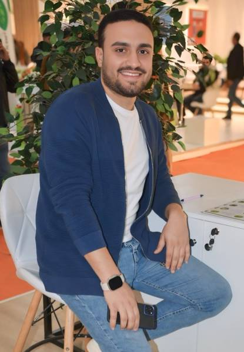

    

        
        <h1>Mo Maher</h1>
        
Software Engineer & Tech Enthusiast

        

            <a href="https://github.com/slorksmo" target="_blank" title="GitHub"></a>
            <a href="https://linkedin.com/in/slorksmo" target="_blank" title="LinkedIn"></a>
            <a href="https://twitter.com/slorksmo" target="_blank" title="Twitter"></a>
        

    

## Featured Articles

    

        <a href="blog/post1">
            

                
                <h3>Building Scalable Systems</h3>
                
Learn about building highly scalable distributed systems...

                Read More →
            

        </a>
    

    

        <a href="blog/post2">
            

                
                <h3>Cloud Native Applications</h3>
                
Best practices for developing cloud native applications...

                Read More →
            

        </a>
    

## Latest Projects

    

        
        

            <h3>Project Name</h3>
            
Brief description of the project and its impact...

            

                React
                Node.js
                MongoDB
            

            <a href="portfolio#project-1" class="project-link">View Details →</a>
        

    

## Newsletter

    <h3>Stay Updated</h3>
    
Subscribe to my newsletter for the latest articles, tutorials, and tech insights.

    <form action="https://formspree.io/f/YOUR_FORM_ID" method="POST" class="newsletter-form">
        <input type="email" name="email" placeholder="Your email address" required>
        <button type="submit">Subscribe</button>
    </form>

